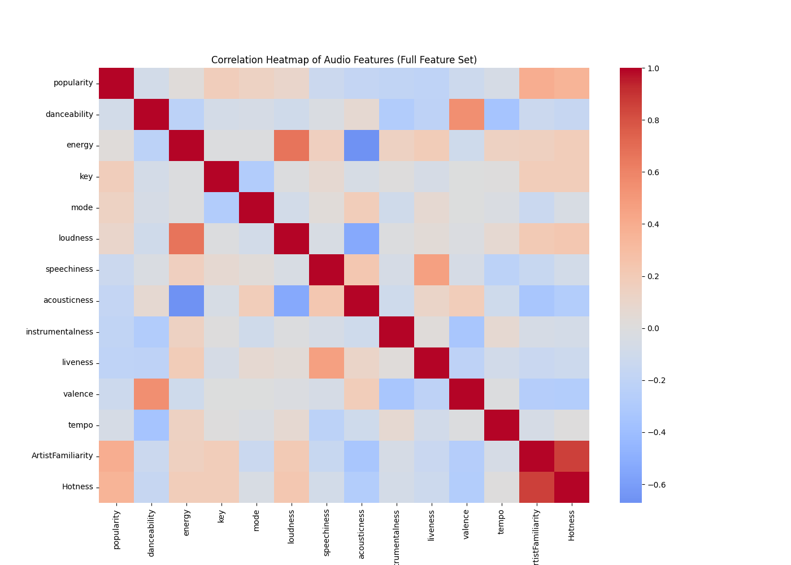
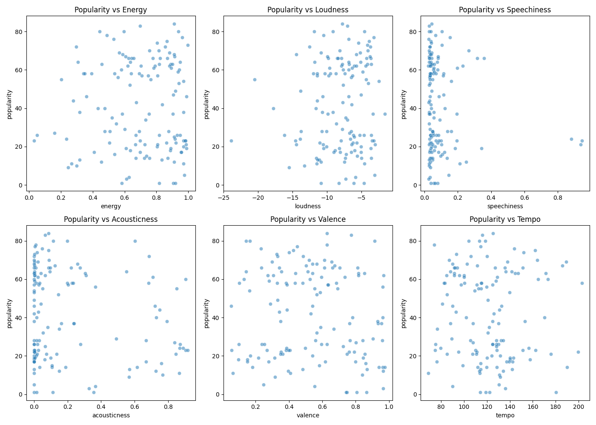
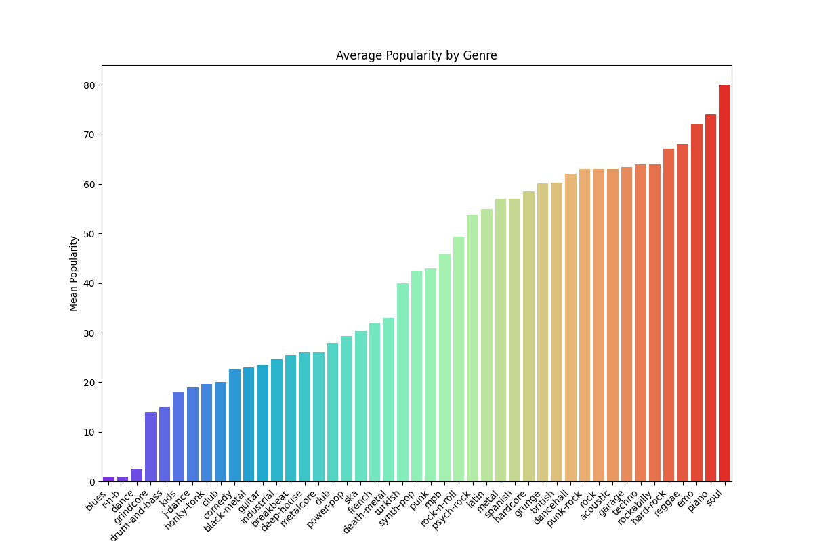
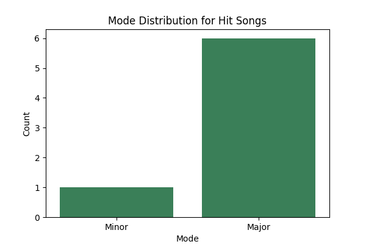

# Project Report: Title

## Contributors
- Dan Feder (djfeder2)
- Zach Olbur (zolbur2)
## Summary
### Project Description
The aim of our project is to understand how audio data and other descriptive information can provide insight into the popularity of music. In this project we will look at two datasets containing information on specific songs. One dataset focuses on songs gathered using the Spotify Web API and the other is centered around song data from a subset of the Million Song Dataset. To accomplish the aim of our project we take this data through a series of steps, including acquisition, quality assessment, data cleaning, data integration, and finally data analysis. 
 
### Project Motivation
Through this project, we are seeking to to understand how audio data and descriptive information contribute to the popularity. Specifically, we hope to observe the relationship between different features and song popularity and also identify which factors contribute most heavily to song popularity. We see the results of this project being useful in a couple of ways. To start, these findings could help encourage inspiring musicians to add aspects to their songs that might help them become more popular. Additionally, these findings could provide a framework for labels to evaluate songs by when choosing which artists to sign. Finally, this project could be used as the foundation for developing a platform that recommends songs to listeners based on their preferences.

### Research Questions
Through this project, we are aiming to answer a two related questions:

Our primary aim is that we want to answer this research question: “Can we use the audio data and descriptive information of a song to predict its popularity? We will train a machine learning model to attempt to answer this question.

We also hope to address this broader research question: “What audio features and descriptive information contribute most strongly to popularity of a song?”. To accomplish this, we will observe the relationships between fields in our dataset, and also analyze the specific details of our trained machine learning model.

### Findings
Our analysis revealed several meaningful patterns across the dataset. The first is that musical features like loudness and energy, valence and danceability, and artist familiarity and hotness are highly correlated which helps us interpret later results more accurately. Some visualizations offered limited insight, but our genre analysis clearly showed that soul, piano, emo, and reggae tend to produce more popular tracks. When we compared the top 5% of songs (“hits”) to the rest, we found that higher energy, stronger danceability, and major keys were all commonalities between successful songs. Finally, our regression model achieved an R² of 0.179 which seems realistic since popularity often depends on external social and commercial factors beyond the audio features themselves.

## Data Profile
### Dataset Descriptions
**Spotify Dataset:** Our first dataset includes song information from Spotify. While we pull the information from huggingface, a third party source, the data was originally gathered by the author of the data using the Spotify Web API. Each observation in this dataset represents one track (one song on Spotify). This dataset includes a few different types of information, including the song’s identifying information, audio feature details, and other descriptive information. Identifying information includes fields such as artists, album name, and track name. There are many audio feature details and other descriptive information provided, such as the song’s energy, danceability, loudness, duration, and temp. More information on these fields can be found in the data dictionary provided. Most notably, this dataset also contains the song’s popularity, which is the focus of our research question. There are 114,000 observations in total in this dataset, which are drawn from a wide variety of artists, genres, and popularity levels.

**Million Song Dataset:** Our second dataset includes additional song information. Similarly to the Spotify dataset, this dataset, pulled from Kaggle, a third party source. However the original source of this data is the Million Song Dataset, a dataset created in 2011 by Columbia University’s Laboratory for the Recognition and Organization of Speech and Audio along with The Echo Nest, a music intelligence company. In addition to the full dataset, which contained one Million Songs, they also released a representative 10,000 song subset of the full dataset. The dataset we use is that 10,000 song subset of the Million Song Dataset. Similarly to the Spotify dataset, each observation in this dataset is also a specific track, or instance of a song. The dataset includes identifying information on the songs as well as descriptive information and audio feature details. It contains a lot of similar information to the Spotify dataset,including the artist name, album name, song name, song duration, and song temp. However, it also includes a few additional fields that will be valuable during analysis and are not in the Spotify dataset, such as artist familiarity and artist hotness (relative buzz surrounding the artist at the time of the dataset’s creation). More information on these fields can be found in the data dictionary provided. This dataset contains 10,000 observations and draws from a variety of artists, genres, and release years.

### Ethical & Legal Considerations
For this project, we used the Spotify Tracks Dataset from Hugging Face and a subset of the Million Song Dataset from Kaggle. Both datasets focus entirely on songs and audio-based features rather than people, which helped minimize any concerns related to respect for persons and consent. Nothing in these datasets contains personal listener information, account data, or anything that could be tied back to an individual, so the ethical risks around confidentiality are very low.
The Spotify dataset is released under a BSD license, which allows reuse as long as proper attribution is given. Since the dataset only includes derived audio features and not the copyrighted audio itself, using and analyzing it should fall well within what the license allows. We do not redistribute the raw files but instead direct others to the original sources.
For the Million Song Dataset, the Kaggle subset lists its license as “unknown,” but the original is intentionally open for academic and research use. One remaining consideration is bias. Both datasets tend to lean toward mainstream, Western music, so our results may reflect those patterns rather than the full global music landscape.
In addition, our analysis aligns with Spotify’s Developer Terms because we never accessed the Spotify API, streamed content, or handled any Spotify Personal Data. We only worked with publicly released research files from Hugging Face and Kaggle and avoided any use of copyrighted audio, and did not train models on the api data but only on the open dataset provided. We also did not store unnecessary data or redistribute Spotify content in any way. By keeping our workflow limited to openly licensed datasets and respecting all boundaries around privacy and data security, our project is compliant with Spotify’s requirements.

## Data Quality
### Quality Analysis Methodology
We conducted our data quality assessment and subsequent data cleaning before data integration. As a result, our quality analysis focused on distinct aspects of both the Spotify dataset and Million Song dataset. We assessed quality through the lens of accuracy, completeness, consistency, and timeliness. Below is a summary of our assessment. The full quality assessment can be found in the workflow folder.

### Quality Analysis Summary
**Accuracy:** Both datasets were deemed to be syntactically accurate as evidenced by observing the different attribute data type choices. One consideration regarding semantic accuracy in the Spotify dataset was the presence of observations with popularity scores of 0. There were 16,020 instances of this in the dataset, equating to roughly 14.05% of all observations. Upon further review, it was clear that many of these songs shouldn’t have a popularity of 0, and were inaccurate values that effectively represented missing data. Given that our research question is centered around popularity, we couldn’t move forward with these rows and removed them during data cleaning. Additionally, both the Spotify and Million Song datasets had instances of tempos of 0. Under ordinary terms, this would have been a concern due it clearly being inaccurate. However, our final integrated dataset doesn’t contain any instances of tempos of 0, so it is not a concern for our use case.

One concern for semantic accuracy in the Million Song dataset was that the energy and danceability were listed as 0 for every observation. Similarly, the year column contains 5320 values of 0, equal to roughly 53.19 percent of all observations. These instances of 0s in these three fields were clearly inaccurate and effectively missing, and were removed during data cleaning.

One final consideration for accuracy is that these datasets were originally created using the Spotify web API and from the Million Song dataset. While we can’t truly confirm the origin of these datasets, the fact that they are cited as being drawn from these credible sources gives us confidence that the data correctly corresponds to the ground truth. Overall, aside from a few considerations that were addressed during data cleaning, we believe that these datasets have strong accuracy. 

**Completeness:** As mentioned above, the popularity field in the Spotify dataset had effectively missing values, represented by a popularity of 0. Additionally, there was only one row in the Spotify dataset with labeled missing data. However, since this row also had a popularity of 0, both of these issues were resolved by dropping observations with popularities of 0.

The Million Song dataset had missing values in 4 columns: ArtistLatitude (1903 missing values), ArtistLocation (1131), ArtistLongitude (1903), and mbID (8). The mbID missing was not a large concern because this identifier was not included in the final integrated dataset. To address the other three fields, we choose to remove them during dating cleaning. Additionally, as mentioned above the Million Song dataset’s energy, danceability, and year fields had large amounts of effectively missing data were also removed during the data cleaning process.

One final consideration is that while these two datasets contain a large amount of data,114,000 and 10,000 rows in the Spotify and Million Song datasets respectively, this data doesn’t include all the songs that data could be collected on. To put it simply, this is not a complete dataset of all songs that in theory could be used for analysis. However, both dataset’s songs are fairly evenly distributed across different genres and the Spotify songs include a wide range of song popularities, and the Million Song dataset shows that it covers a wide range of different years. As such, we believe these datasets are representative and were sufficient to conduct a proper analysis on.

Overall, the missing values in popularity needed to be addressed in the Spotify dataset, and missing values in ArtistLatitude, ArtistLocation, ArtistLongitude, and Year needed to be addressed in the Million Song dataset. Once these concerns were addressed, we believe that this data exhibits very strong completeness.
	

**Consistency:** With the exception of tempo and the Million Song dataset’s year column, which have already been discussed, there were not any clear domain violations within either dataset. The other consideration related to consistency is the existence of duplicate values. For our analysis, we didn’t want the same song by the same artist to exist twice in the dataset. The Spotify dataset had 49,340 instances of this and 894 complete duplicates, and the Million Song dataset had 119 instances of this but 0 complete duplicates. This was addressed during data cleaning. Both datasets are stored in a csv and are each represented as one single table, so there was no concern of inter-relation constraints being violated for either dataset. Overall, the consistency of these datasets seem strong.

**Timeliness:** Both datasets are static datasets, meaning that their contents will not ever be updated. However, for the most part, this is not a concern. The data has incredibly low volatility, as the attributes such as artist and song title do not change for songs, and the audio features gathered are almost never updated for songs once they are created for both original sources (the Spotify api and Million Song dataset). One additional consideration is that the Spotify dataset has not been updated since 2023, and the Million Song dataset doesn’t contain any songs more recent than 2010. As a result, it is fair to say that they are not the most current datasets. However, we don’t believe this is necessarily an issue, as long as finders are interpreted accordingly.

### Final Assessment
Overall, the general theme that emerged from our data quality assessment is that each dimension of quality had a few considerations that needed to be addressed. However, we believe that these considerations were addressed properly during the data cleaning, integration, and analysis processes. As a result, we believe we were left with two quality datasets that were fit for use and able to be used for effective analysis.

## Findings
Figure 1: A correlation heatmap

This figure helps us understand the correlation between all of the relevant musical features from our dataset. As we can see from this figure, loudness and energy are highly correlated, valence (happiness or sadness) and danceability are highly correlated and liveness and speechiness are highly correlated. Artist familiarity and hotness are also highly correlated. Understanding these correlations helps us read the rest of our results in a smarter way. Seeing that features like loudness and energy or valence and danceability move together suggests they’re capturing similar musical qualities. Knowing this early on lets us avoid redundant features in our models and focus on the variables that actually add new information when we try to predict song popularity.

Figure 2: Scatterplot relationships between variables

This figure is less helpful in our analysis. We see a lot more randomness in the relationships between the variables. Any conclusions from this figure can only be defined as assumptions or inferences and not fact.

Figure 3: Genre popularity histogram

This figure is extremely helpful in our analysis as it shows us which genres contribute most to a song’s popularity. We find that soul, piano, emo, and reggae have a high impact on the overall popularity of a track. This helps our research question as we can point aspiring musicians to this graph to show what genres might help them become most popular.

Figure 4: Factors regarding whether a song is a hit or not

For this figure we identified the top 5 percent of popular songs. Those top 5 percent were the threshold for whether a song is a hit or not. We see that energy and danceability are good factors in whether or not a song will be a hit.

Figure 5: Major vs Minor Songs histogram

This figure very clearly shows that major songs contribute more to a song being a hit than minor songs.

Figure 6: Model results

Finally, in reference to our research question: Can we calculate the popularity of a song based on factors like key signature, tempo, and other relevant variables? When training a regression model to predict popularity from audio features, we achieved an R² of 0.179. While this may seem low at first glance, it is actually consistent with expectations for this type of prediction. Song popularity is influenced by many external factors including marketing, artist visibility, cultural trends, and platform promotion that are not captured in the audio features alone. As a result, we should not expect acoustic attributes to fully explain popularity.

## Future Work

Future work for this specific Spotify data analysis could be extremely valuable. When we started this project with these two datasets, we were aiming to understand if we could calculate the popularity of a song based on factors like key signature, tempo, and other relevant variables. We knew immediately that this would require machine learning and some sort of model to predict song popularity. While factors like streams, listeners, and more could help understand a song's popularity, we wanted to help aspiring musicians understand this in terms of tangible features they can use in their songs. Additionally, we wanted to also help people interested in songs find songs that work for them based on their preference. With our analysis, we found that there is still a long way to go.
In the future, we would have definitely liked having a larger dataset. Where we currently are with around 150 rows is not enough for a thorough analysis or an accurate model. There just aren’t enough features and unfortunately any model created right now would overfit to the training dataset. We need variability and that comes with a lot more information. Strategies to increase rows could be to use the Spotify api directly and omit the integration portion of the analysis. Because we were integrating two datasets, it led to a mass decrease in rows. Additionally, we could look for more connectable datasets with more similar features. Perhaps digging deeper into Spotify data sources could have helped us with this.
We also acknowledge that because of the lack of rows, our visualizations are very biased towards the small amount of songs that are featured in our current dataset. This is especially evident in the popularity of the genre section of our analysis. While genres like soul, piano, emo, and reggae stood out as being very popular, common knowledge tells us that pop, rock, and rap should also be up there in terms of popular genres. Future work would require diving further into this disparity to understand where we may have gone wrong so we could better predict the user's musical interests.
In terms of data handling and reproducibility, documentation is something we would want to iron out more in the future. Some of our data comes from datasets without great documentation and this could cause some ethical data handling issues as well as accuracy problems. To alleviate this, we could have looked into different data sources, or dug deeper into the sources we provided to validate the data.
For data validation, with more time we could have pulled the data from the Spotify API ourselves to limit the use of third parties and have a lot more accurate information.
Overall, this project has a lot of potential and is definitely something that should be looked into further. Musical interests are very important to people and it could be very valuable to build a platform that recommends music to people in a way that Spotify cannot. We can make something more personal, more interesting, and more accurate than Spotify with more time.

## Reproducing
### Location of Relevant Items
**Results Reproduction:** In the workflow directory, there is a notebook titled automated reproducing. To reproduce our results, users should navigate to that notebook. This notebook is sufficient for reproducing our results. The notebook interacts with the following items.

**Scripts:** The scripts folder contains all of the python scripts called during our automated reproduction of our workflow.

**Raw Data Files:** Our data is collected programmatically using the Kaggle API for the Million Song dataset. The Spotify dataset is also aquried programatically from huggingface using pandas. The primary source of the Spotify data is the Spotify Web API. Additionally, both raw data CSVs can be found in the data/raw directory. 

**Software Dependencies:** There is a requirements.txt file in our root directory that contains all software dependencies. This requirements.txt file is called on during our automated workflow.

**Results:** Our results can be found at this [link](https://uofi.box.com/s/3xwnbbr2sybu0wjdhbgxqfzz4rng4ba8). Additionally, results are stored in the results folder out of our repository. 

### Reproduction Instructions
As stated above, to reproduce our results, users should navigate to  “workflow/7_automated_reproducing.ipynb” and carry out the follow steps:

1.  Optional: Run "Install Snakemake" Cell: If you do not have snakemake installed yet, run this code block in order to install it.
2. Run "Test Reproduce" Cell: This code cell is designed to run the Snakefile and confirm that it is working before delete all the files. To complete this step, you will need to obtain and enter a Kaggle API token. Below these steps are instructions for how to do that. When you run the cell, ensure that you are getting the output "Nothing to be done (all requested files are present and up to date)" before moving forward. 
3. Run "Delete Output and Reproduce Results" Cell:  Assuming step 2 was successful, you can now run the third code cell. This will delete all outputs and then recreate our workflow. After it is finished running, you should be able to confirm that the results match our results.

Kaggle API Setup Instructions: 
1. Go to your preferred browser, navigate to kaggle.com, and sign in.
2. Navigate to setting by selecting your profile icon in the top right corner and selecting settings.
3. Under the account page of settings (the default page), scroll down to the API section and click "generate new token"
4. Give the token a name and select generate.
5. On your screen, you should see a field labeled "API Token:. Copy this field.
6. Paste the API token in the code block below in place of "enter_key_here". Make sure the token is surrounded by quotes ("token")
7. Paste your username in the cell below where it says "enter_username_here", again surrounded by quotes. Your username can be seen in the top right corner on the Kaggle settings page.
8. With the token and username entered, run the code cell below. Now, you should be ready to use the Kaggle API

All of this information is contained in “workflow/automated_reproducing.ipynb”. If for any reason this process fails, there is a secondary method of partial reproduction placed in the notebook.

## References

Olbur, Z & Feder, D. (2025). IS-477-Group-Project [Code repository]. GitHub. https://github.com/zacholbur/IS-477-Group-Project

Hugging Face. (2025). Spotify Tracks Dataset [Data set]. 
https://huggingface.co/datasets/maharshipandya/spotify-tracks-dataset

Kaggle. (2022). Million Song Dataset (subset) [Data set]
https://www.kaggle.com/datasets/sansastark/subset-of-the-million-song-dataset

Matplotlib Development Team. (2024). Matplotlib. https://matplotlib.org/

Microsoft. (n.d.). Visual Studio Code. Microsoft. https://code.visualstudio.com/

Record Linkage Toolkit Development Team. (2024). recordlinkage. https://recordlinkage.readthedocs.io/

Spotify AB. (2025, May 15). Spotify Developer Terms.
https://developer.spotify.com/terms
